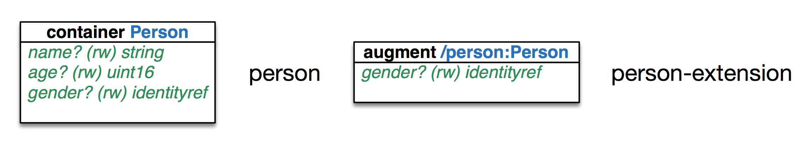

.. autocmd BufWritePost index.rst !make slides
.. OpenConfig with NAPALM documentation master file, created by
   sphinx-quickstart on Sun Sep 17 13:04:26 2017.
   You can adapt this file completely to your liking, but it should at least
   contain the root `toctree` directive.

OpenConfig with NAPALM
======================

.. rst-class:: author

David Barroso <dbarrosop@dravetech.com>

Agenda
------

1. What is YANG?
2. What is OpenConfig?
3. What is napalm-yang?

.. rst-class:: section

What is YANG?
-------------

What is YANG?
-------------

1. A Data Modeling Language for the Network Configuration Protocol (NETCONF)
2. RFC6020

----

.. rst-class:: sub-title build-item-1

    What is not YANG?

.. rst-class:: build-item-1

1. Not an API
2. Not developed exclusively for NETCONF/gRPC
3. Not JSON or XML

.. rst-class:: build-item-2

.. warning:: Not a YANG tutorial so forgive the handwaving

YANG vs JSON vs XML
-------------------

.. rst-class:: float-50

.. literalinclude:: ../examples/yang/person.yang
   :caption: person.yang
   :language: yang

.. rst-class:: float-50

.. literalinclude:: ../examples/yang/person.json
   :caption: person.json
   :language: json

.. rst-class:: float-50

.. literalinclude:: ../examples/yang/person.xml
   :caption: person.xml
   :language: xml

Why do I care?
--------------

.. code-block:: bash
    :caption: generate documentation

    $ pyang -f tree person.yang
    module: person
        +--rw Person
           +--rw name?   string
           +--rw age?    uint16

.. rst-class:: float-50

.. code-block:: bash
    :caption: generate diagrams

    $ pyang -f omni person.yang > person.scpt
    $ osascript person.scpt

.. rst-class:: float-50

.. image:: _static/person.png
   :scale: 30 %

.. nextslide::

.. code-block:: bash
    :caption: generate code

    $ export PYBINDPLUGIN=`/usr/bin/env python -c \
     'import pyangbind; import os; print "%s/plugin" % os.path.dirname(pyangbind.__file__)'`
    $ pyang --plugindir $PYBINDPLUGIN -f pybind person.yang > person.py

.. literalinclude:: ../examples/yang/person.py
   :caption: person.py (excerpt)
   :language: python
   :lines: 23, 32, 35, 36, 41, 42, 70, 71, 79

.. nextslide::

.. literalinclude:: ../examples/yang/test_person.pysh
   :language: python
   :emphasize-lines: 4-7
   :linenos:

.. nextslide::

.. literalinclude:: ../examples/yang/test_person.pysh
   :language: python
   :emphasize-lines: 9-11
   :linenos:

.. nextslide::

.. literalinclude:: ../examples/yang/test_person.pysh
   :language: python
   :emphasize-lines: 11-15
   :linenos:

.. nextslide::

.. literalinclude:: ../examples/yang/test_person.pysh
   :language: python
   :emphasize-lines: 16-18
   :linenos:

Extensibility (augmenting the model)
------------------------------------

Augmentations are part of the "standard" model

.. rst-class:: float-50

.. literalinclude:: ../examples/yang/person-extension.yang
   :caption: person-extension.yang
   :language: yang
   :lines: 1, 11-22

.. rst-class:: float-50

.. literalinclude:: ../examples/yang/person-extension.yang
   :caption: person-extension.yang (cont'd)
   :language: yang
   :lines: 24-34

.. nextslide::

.. code-block:: bash
    :caption: generate documentation

    $ pyang -f tree person-extension.yang person.yang
    module: person
        +--rw Person
           +--rw name?                      string
           +--rw age?                       uint16
           +--rw person-extension:gender?   enumeration

.. code-block:: bash
    :caption: generate diagrams

    $ pyang -f omni person-extended.yang person.yang > person-extended.scpt
    $ osascript person-extended.scpt

Extensibility (deviating the model)
------------------------------------

Deviations are failures in model implementation

.. literalinclude:: ../examples/yang/person-deviation.yang
   :caption: person-deviation.yang
   :language: yang
   :lines: 1,11-13

.. code-block:: bash
    :caption: generate documentation
    :emphasize-lines: 5

    $ pyang -f tree person-deviation.yang person.yang
    module: person
        +--rw Person
           +--rw name?                      string
                                                    # no age

I'm Outta Here
--------------

.. image:: _static/abandon.gif
   :scale: 200 %
   :alt: I'm outta here
   :align: center

No, Seriously
-------------

Most people won't really care but having YANG models means you have one single source of truth to generate documentation, code and validate data. You might not consume YANG models yourself to do those things but you might indirectly via your NMS or tools.

.. rst-class:: section

What is OpenConfig?
-------------------
